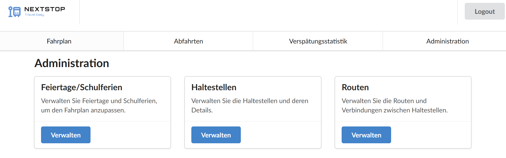
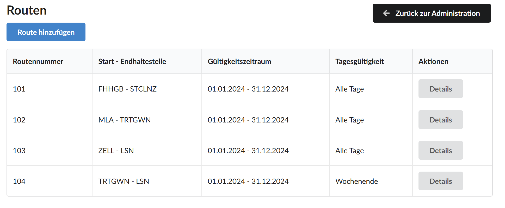

# Dokumentation WEA5-Projekt Bernd Zeiler

## Inhaltsverzeichnis

- [Architektur](#architektur)
  - [Komponentenbaum-Diagramm](#komponentenbaum-diagramm)
  - [Wichtige Komponenten](#wichtige-komponenten)
  - [Zusammenhang Services mit Komponenten](#zusammenhang-services-mit-komponenten)
  - [Models](#models)
  - [Helpers](#helpers)
- [Navigationswege-Diagramm](#navigationswege-diagramm)
- [Testlauf](#testlauf)
  - [Szenario 1: Verkehrsunternehmen melden sich am System an, um die Pflege des neuen Fahrplans durchzuführen](#szenario-1-verkehrsunternehmen-melden-sich-am-system-an-um-die-pflege-des-neuen-fahrplans-durchzuführen)
  - [Szenario 2: Feiertage und Schulferien für 2025 werden verwaltet, um den Fahrplan davon abhängig machen zu können](#szenario-2-feiertage-und-schulferien-für-2025-werden-verwaltet-um-den-fahrplan-davon-abhängig-machen-zu-können)
  - [Szenario 3: Haltestellen können angelegt und bearbeitet werden](#szenario-3-haltestellen-können-angelegt-und-bearbeitet-werden)
  - [Szenario 4: Routen können inkl. Abfahrtszeiten erstellt werden](#szenario-4-routen-können-inkl-abfahrtszeiten-erstellt-werden)
  - [Szenario 6: Fahrplanabfragen können gemacht werden](#szenario-6-fahrplanabfragen-können-gemacht-werden)
    - [beinhaltet Szenario 5: Haltestellen können gesucht werden, z. B. nach dem Namen oder anhand des aktuellen Standorts](#beinhaltet-szenario-5-haltestellen-können-gesucht-werden-z-b-nach-dem-namen-oder-anhand-des-aktuellen-standorts)
  - [Szenario 7: Anzeigetafeln zeigen die nächsten Abfahrten für die aktuelle Haltestelle](#szenario-7-anzeigetafeln-zeigen-die-nächsten-abfahrten-für-die-aktuelle-haltestelle)
  - [Szenario 8: Busse checken ihren aktuellen Standort ein](#szenario-8-busse-checken-ihren-aktuellen-standort-ein)
  - [Szenario 9: Verspätungen werden in der Suche und auf der Anzeigetafel berücksichtigt](#szenario-9-verspätungen-werden-in-der-suche-und-auf-der-anzeigetafel-berücksichtigt)
  - [Szenario 10: Eine Verspätungsstatistik gibt Auskunft über die Pünktlichkeit aller Verkehrsmittel](#szenario-10-eine-verspätungsstatistik-gibt-auskunft-über-die-pünktlichkeit-aller-verkehrsmittel)
    - [beinhaltet Szenario 11: Darstellung der Verspätungsstatistik in Diagrammen](#beinhaltet-szenario-11-darstellung-der-verspätungsstatistik-in-diagrammen)
- [Fragen beantworten](#fragen-beantworten)
  - [Was ist zu tun, wenn sich URLs ändern? Wie invasiv ist der Eingriff in Ihre Anwendung um diese zu ändern?](#was-ist-zu-tun-wenn-sich-urls-ändern-wie-invasiv-ist-der-eingriff-in-ihre-anwendung-um-diese-zu-ändern)
  - [Wie stellen Sie sicher, dass bestimmte Seiten nur nach einem Login zugreifbar sind?](#wie-stellen-sie-sicher-dass-bestimmte-seiten-nur-nach-einem-login-zugreifbar-sind)
  - [Wie stellen Sie eine korrekte Dateneingabe sicher?](#wie-stellen-sie-eine-korrekte-dateneingabe-sicher)
  - [Was passiert, wenn Aufrufe an das Backend Fehler produzieren?](#was-passiert-wenn-aufrufe-an-das-backend-fehler-produzieren)
- [Setup](#setup)
- [Externe Teile](#externe-teile)

## Architektur

### Komponentenbaum-Diagramm


Hinweis: Alle Rechtecke demonstrieren meine Komponenten (Der Guard in der Raute ist keine direkte Komponente). Die Farben haben keine konkrete Bedeutung, sie dienen nur für die Visualisierung der hierarchischen Ebenen.

### Wichtige Komponenten

#### TripPlannerComponent

Die Startseite der Applikation. Hier kann man Fahrplanabfragen durchführen. Die Komponente beinhaltet die Auswahl der Start- und Zielhaltestelle, Datum und Uhrzeit, Abfahrts- oder Ankunftszeit und die gewünschte Anzahl an Verbindungen. <br>
Für die Auswahl der Start- bzw. Zielhaltestelle kann man entweder über die `StopSearchComponent` mit Namen oder über die `GpsSearchComponent` mit dem aktuellen Standort suchen. <br>
Die gefundenen Verbindungen werden mit Berücksichtigung von möglichen Verspätungen(Check-Ins) in einer Tabelle angezeigt.

#### DeparturesComponent

Hier werden die nächsten Abfahrten für eine bestimmte Haltestelle angezeigt. Die Komponente beinhaltet eine Haltestelle, Datum und Uhrzeit und die gewünschte Anzahl an Verbindungen. <br>
Für die Auswahl der Haltestelle kann der User wieder entscheiden ob er nach Namen oder GPS-Koordinaten der Haltestelle suchen will. <br>
Die nächsten Abfahrten werden wieder mit Berücksichtigung von Verspätungen in einer Tabelle angezeigt.

#### DelayStatisticsComponent

Hier kann man sich eine Verspätungsstatistik über die Pünktlichkeit aller Verkehrsmittel ausgeben lassen. Die Komponente beinhaltet den gewünschten Zeitraum(Start- und Enddatum) und eine optionale Routennummer, falls die Statistikauswertung spezifisch für eine Route ausgegeben werden soll. <br>
Die Ausgabe der durchschnittlichen Verspätungen wird in Form eines Balkendiagramms (mithilfe der Libraries `chart.js` und `ng2-charts`) angezeigt.

#### LoginComponent

Hier kann man sich als Administrator anmelden. Über diese Komponente wird man auf die `Keycloak`-Anmeldemaske weitergeleitet, wo sich der Admin mit seinen Zugangsdaten einloggen kann. Bei erfolgreicher Anmeldung wird man auf die eigentliche Webseite zurückgeleitet und die `AdminComponent` wird über den `CanNavigateToAdminGuard` damit freigeschalten.

#### AdminComponent

Hier kann man Feiertage/Schulferien, Haltestellen und Routen verwalten. Über diese Komponente gelangt man zu den jeweiligen 3 Komponenten.

#### HolidaysComponent

Hier kann man Feiertage bzw. Schulferien verwalten. Die vorhandenen Feiertage (inkl. Kennzeichnung von Schulferien) werden in einer Tabelle angezeigt. Man kann dort einen neuen Feiertag anlegen als auch einen vorhandenen bearbeiten, indem man auf die `HolidayFormComponent` weitergeleitet wird. Das Löschen eines vorhandenen Feiertags ist ebenfalls möglich.

#### StopsComponent

Hier kann man Haltestellen verwalten. Die vorhandenen Haltestellen werden in einer Tabelle angezeigt. Man kann dort eine neue Haltestelle anlegen als auch eine vorhandene bearbeiten, indem man auf die `StopFormComponent` weitergeleitet wird. Das Löschen einer vorhandenen Haltestelle ist ebenfalls möglich. 

#### RoutesComponent

Hier kann man Verbindungen (Routen und deren Haltestellen) verwalten. Die vorhandenen Verbindungen werden in einer Tabelle angezeigt. Man kann dort eine neue Route inkl. aller Haltestellen-Informationen mit einem einzigen Request anlegen, indem man auf die `RouteFormComponent` weitergeleitet wird. Ebenso kann man sich die Details von vorhandenen Routen anzeigen lassen, indem man auf die `RouteDetailsComponent` weitergeleitet wird. Das Bearbeiten und Löschen ist hier nicht möglich, weil es lt. Aufgabenstellung nicht gefordert war.

#### StopSearchComponent

Diese Komponente ist ein Suchfeld, wo Haltestellen anhand ihres Namens gesucht werden können. Diese Komponente ist Teil innerhalb der `TripPlannerComponent`, `DeparturesComponent` und `RouteFormComponent`.

#### SelectedStopDisplayComponent

Diese Komponente zeigt z.B. in der Abfahrten-Seite die letzendlich ausgewählte Haltestelle des Users an, welche von der `StopSearchComponent` oder `GpsSearchComponent` gefunden wurde.

#### GpsModalComponent

Diese Komponente öffnet z.b. in der Abfahrten-Seite ein Dialogfenster, wo dann die `GpsSearchComponent` angezeigt wird.

#### GpsSearchComponent

In dieser Komponente kann man sich anhanden des aktuellen Standorts die nächstgelegenen Haltestellen anzeigen lassen.

### Zusammenhang Services mit Komponenten

#### TripPlannerService

Die `TripPlannerComponent` erhält hier die gefundenen Verbindungen für die mitgegebene Start- und Zielhaltestelle und weiteren Parmetern.

#### DepartureService

Die `DeparturesComponent` erhält hier die gefundenen nächsten Verbindungen ausgehend von der mitgegebenen Haltestelle, wo man wegfahren will.

#### DelayStatisticsService

Die `DelayStatisticsComponent` erhält hier die Verspätungsstatistikdaten ausgehend von dem eingegebenen Zeitraum und optionaler Routennummer.

#### AuthenticationService

Dieses Service wird von der `LoginComponent` verwendet, um den Login-Prozess über Keycloak zu initialisieren und den Authentifizierungsstatus des Benutzers zu prüfen. <br> Sie wird außerdem von der `AppComponent` genutzt, um den Login-Status abzufragen und auch um den Benutzer wieder auszuloggen.

#### HolidaysService

Dieses Service wird von der `HolidaysComponent` und `HolidayFormComponent` verwendet, um die notwendigen Create-Read-Update-Delete(CRUD)-Abfragen ausführen zu können.

#### StopsService

Dieses Service wird von der `StopsComponent` und `StopFormComponent` verwendet, um die notwendigen Create-Read-Update-Delete(CRUD)-Abfragen ausführen zu können. <br>
Auch die `RouteDetailsComponent` verwendet das Service, um die Haltestellen für eine bestimmte Route detailliert ausgeben zu können. <br>
Ebenfalls benötigen die `StopSearchComponent` und `GpsSearchComponent` das Service, um die Haltestellen anhand eines Suchbegriffes(Name oder GPS-Position der Haltestelle) abfragen zu können.

#### RoutesService

Dieses Service wird von der `RoutesComponent`, der `RouteFormComponent` und der `RouteDetailsComponent` verwendet, um Get- und Create-Anweisungen durchführen zu können. <br>
Außerdem benötigt dieses Service auch die `DelayStatisticsComponent`, damit sich der User aus allen vorhandenen Routen die Verspätungsstatistik anzeigen lassen kann.

### Models

Models wurden erstellt, um die Datenstruktur der Anwendung typsicher zu definieren. Sie erleichtern die Interaktion zwischen Services und Komponenten sowie die Verarbeitung von Backend-Daten, wie z. B. Haltestellen, Verbindungen und Benutzerinformationen.

### Helpers

#### ChartConfig

Definiert die Konfiguration und die Datenstruktur für die Darstellung der Verspätungsstatistik in einem Balkendiagramm mithilfe von `chart.js`.

#### Validators (Directives)

Direktiven wie z.B. die `DateRangeValidatorDirective` validieren Benutzereingaben, z. B. ob das Enddatum nach dem Startdatum liegt, und stellen so sicher, dass die Eingabedaten korrekt sind. Ich habe für das Projekt ein großes Augenmerk auf Input-Validation gelegt.

#### ErrorMessages

Bündelt alle spezifischen Fehlermeldungen für Formulare wie `HolidayForm`, `StopForm`, und `RouteForm`, um konsistente und benutzerfreundliche Validierungsnachrichten anzuzeigen.

## Navigationswege-Diagramm


## Testlauf

### Szenario 1: Verkehrsunternehmen melden sich am System an, um die Pflege des neuen Fahrplans durchzuführen


Klick auf den `Login`-Button auf der Hauptseite rechts oben oder in der Navbar auf den Admin-Bereich. Man wird auf das Anmeldefenster von Keycloak weitergeleitet. <br>
Hinweis: Ein eingebauter Guard prüft, ob der Benutzer authentifiziert ist, um die Admin-Funktionen nützen zu dürfen.


Den Anmeldevorgang übernimmt Keycloak. Bei Eingabe der gültigen Benutzer/Admindaten wird der Login erfolgreich durchgeführt, man gelangt zur eigentlichen Webseite zurück und das Access/Bearer Token wird gespeichert. Bei ungültiger Eingabe erfolgt eine Fehlermeldung von Keycloak.



Der Guard schaltet den Adminbereich jetzt frei, weil dieser eine gültige Authentifizierung entgegennimmt und alle Admin-funktionen können jetzt genutzt werden.

### Szenario 2: Feiertage und Schulferien für 2025 werden verwaltet, um den Fahrplan davon abhängig machen zu können


Klick auf den `Verwalten`-Button im Adminbereich.


Hier sieht man alle Feiertage inklusive Kennzeichnung, ob es sich um Schulferien handelt, in einer Tabelle nach Startdatum sortiert aufgelistet. Neben der Abfrage der Feiertage kann man auch über Buttons Feiertage neu hinzufügen, bestehende bearbeiten oder löschen. Genauso gelangt man mit dem Button `Zurück zur Administration` zur Adminhauptseite retour.


Klickt man auf den Button `Feiertag hinzufügen`, kann man in einem Formular die Daten für den neuen Feiertag eingeben. Es wird besonders auf Eingabevalidierung geachtet: Es benötigt eine gültige Bezeichnung, Startdatum und Enddatum. 


Zudem wird über eine eingebundene Directive geprüft, ob das eingegebene Startdatum kleiner ist als das Enddatum, ansonsten wird auch ein Fehler angezeigt. Erst bei gültigen Eingaben wird der `Hinzufügen`-Button enabled und der Feiertag zur Tabelle hinzugefügt.


Klickt man auf den Button `Bearbeiten` eines Feiertags, werden die bislang gespeicherten Daten dem User angezeigt und dieser kann sie entsprechend abändern. Ansonsten wird genau dieselbe Formularkomponente wie beim Create verwendet.

### Szenario 3: Haltestellen können angelegt und bearbeitet werden


Klick auf den `Verwalten`-Button im Adminbereich.


Hier sieht man alle Haltestellendaten wieder in Tabellenform. Neben der Abfrage der Haltestellen kann man hier auch wieder über Buttons Haltestellen neu hinzufügen, bestehende bearbeiten oder löschen. Genauso gelangt man mit dem Button `Zurück zur Administration` ebenfalls zur Adminhauptseite retour.


Klickt man auf den Button `Haltestelle hinzufügen`, kann man in einem Formular die Daten für die neue Haltestelle eingeben. Es wird erneut besonders auf Eingabevalidierung geachtet: Es benötigt eine gültige Bezeichnung, Kurzbezeichnung, Breiten- und Längengrad für die GPS-Koordinaten. 


Bei der Eingabe der Kurzbezeichnung wird geprüft, ob diese nicht bereits vorhanden ist bzw. keine Sonder- und Leerzeichen enthält.


Bei der Eingabe der GPS-Koordinaten habe ich auch noch zusätzliche Eingabevalidierung hinzugefügt.


Klickt man auf den Button `Bearbeiten` einer Haltestelle, werden die bislang gespeicherten Daten dem User wieder angezeigt und dieser kann sie entsprechend abändern. Ansonsten wird genau dieselbe Formularkomponente wie beim Create verwendet. Zusätzlich kann beim Update die Kurzbezeichnung nicht verändert werden, weil diese eindeutig ist und in der Datenbank als Primary-Key bei uns hinterlegt ist.

### Szenario 4: Routen können inkl. Abfahrtszeiten erstellt werden


Klick auf den `Verwalten`-Button im Adminbereich.



Hier sieht man alle Routendaten inklusive Routennummer, Start- und Endhaltestelle der Route und Gültigkeitsbereich ebenfalls in Tabellenform. Neben der Abfrage der Routen kann man hier über Buttons Routen neu hinzufügen und bestehende genauer einsehen(Update und Delete wurde lt. Aufgabenstellung nicht eingebaut).Genauso gelangt man mit dem Button `Zurück zur Administration` ebenfalls zur Adminhauptseite retour.


Klickt man auf den Button `Route hinzufügen`, kann man in einem Formular die Daten für die neue Route und deren angefahrenen Haltestellen eingeben. Es wird erneut besonders auf Eingabevalidierung geachtet: Es benötigt ein gültiges Start- und Enddatum wieder(auch hier wurde dieselbe Directive für die Überprüfung Startdatum < Enddatum eingebunden) und zumindest eine hinzugefügte Haltestelle für die neue Route. 


Durch eingabe im Suchfeld werden mögliche Haltestellen nach ihrem Namen gefunden, welche der User auswählen kann. 


Mit Eingabe der Abfahrtszeit kann der User die Haltestelle für die Route zwischenzeitlich hinzufügen und aber auch dort direkt wieder entfernen falls diese doch nicht passt. Mit Klick auf `Speichern` letzendlich wird die Route mit allen angegebenen Haltestellen in einem Request angelegt.

### Szenario 6: Fahrplanabfragen können gemacht werden
#### beinhaltet Szenario 5: Haltestellen können gesucht werden, z. B. nach dem Namen oder anhand des aktuellen Standorts


Im Menüpunkt `Fahrplan` kann der User Fahrpläne abfragen. Dazu muss er zunächst Start- und Zielhaltestelle eingeben. Die Haltestellenauswahl kann entweder durch Sucheingabe des Namens (die Suchkomponente ist die gleiche wie bereits bei den Routen im Adminbereich) oder über `Standortbasierte Suche` erfolgen (Szenario 5 jetzt). Weiters benötigt wird Datum und Uhrzeit, Auswahl ob Abfahrts- oder Ankunftszeit gemeint ist und welche maximale Anzahl an Verbindungen ausgegeben wernden soll.


Bei der namensbasierten Haltestellensuche kann der User Suchbegriffe direkt im Suchfeld eingeben. Auch Haltestellen mit unterschiedlichen Schreibweisen wie hier Sankt oder St. werden identifiziert.


Neben der namensbasierten Suche kann der User durch Klick auf den Button `Standortbasierte Suche` die nächstgelegenen Haltestellen von seinem Standort aus finden. Dazu öffnet sich ein Dialogfenster, wo Dateneingaben wie maximale Entfernung bzw. Ergebnisse eingegeben werden können. Bei erfolgreicher Suche kann der User die gewünschte Haltestelle auswählen, der Dialog schließt sich und die Haltestelle wird übernommen(entweder als Start- oder halt Zielhaltestelle, je nachdem wo der User den Button klickt).


Bei gefundenen Verbindungen werden diese dem User in tabellarischer Form wieder repräsentiert. Das Backend berücksichtigt Verbindungen mit 0 oder 1 Umstieg und die Tagesgültigkeit. Auch die Verspätung wird berücksichtigt, diese wird auch frontendmäßig angezeigt - siehe Szenario 9 dann genauer.


Bei keinen gefundenen Verbindungen wird eine entsprechende Hinweismeldung ausgegeben.

### Szenario 7: Anzeigetafeln zeigen die nächsten Abfahrten für die aktuelle Haltestelle


Im Menüpunkt `Abfahrten` kann der User die nächsten Abfahrten von der gewünschten Haltestelle aus finden.
Diese Komponente ist sehr ähnlich wie die Fahrplan-Komponente aufgebaut. Die Haltestelle kann wieder über den Namen oder standortbasiert gesucht und ausgewählt werden. Ebenso können Datum/Uhrzeit und die Anzahl an Verbindungen ausgewählt werden.


Die nächsten gefundenen Abfahrten inkl. Zielhaltestelle werden dann dem User wieder in Tabellenform angezeigt. Bei keiner gefundenen Verbindung von der Abfahrtshaltestelle aus wird dem User wieder eine Hinweismeldung angezeigt.

### Szenario 8: Busse checken ihren aktuellen Standort ein

Das hat im Frontend lt. Anforderungen nicht implementiert werden müssen. Aber für die Berücksichtigung der Verspätungen in der Fahrplan- bzw. Abfahrtskomponente als auch dann in der Verspätungsstatistik wird ein CheckIn zur Demonstration manuell durchgeführt. <br>

Checkin wird manuell durchgeführt für:
- Route: `106` (Haltestellen: FR - FHHGB - HBFLNZ)
- CheckIn-Haltestelle: `Freistadt Stiferplatz (FR)`
- DateTime: `21.01.2025 06:10` (10 Minuten verspätet)

### Szenario 9: Verspätungen werden in der Suche und auf der Anzeigetafel berücksichtigt

Der zuvor erstellte CheckIn wird jetzt berücksichtigt sowohl in der Fahrplansuche und in der Anzeigetafel berücksichtigt.


Hier wird eine Fahrplansuche für die Starthaltestelle `FH Hagenberg (FHHGB)` und Zielhaltestelle `Hauptbahnhof Linz (HBFLNZ)` am 21.01.2025 mit Abfahrtszeit 06:35 erstellt. Normalerweise würde der Bus regulär um 06:30 bereits in Hagenberg eintreffen, aber die Verspätung in Höhe von 10 Minuten von der vorherigen Haltestelle `Freistadt Stifterplatz (FR)` wird für alle nachkommenden Haltestellen in der Route berücksichtigt. Daher kommt der Bus erst um 06:40 in Hagenberg an und der User kann diesen Bus noch erwischen.


Umgekehrt, wenn der User Ankunftszeit auswählt, funktioniert es genauso. Hier möchte der User um 07:05 in Linz spätestens ankommen. Normalerweise würde der Bus um 07:00 in Linz eintreffen aber durch die Verspätung von 10 Minuten schafft der Bus das nicht und deswegen wird die Verbindung nicht angezeigt. Gäbe es diese Verspätung nicht, würde er um 07:00 pünktlich in Linz ankommen und die Verbindung würde angezeigt werden.


Auf der Anzeigetafel (also bei den Abfahrten) funktioniert die Berücksichtigung der Verspätung genauso. Hier könnte der User den Bus genau noch um 06:40 erwischen.

### Szenario 10: Eine Verspätungsstatistik gibt Auskunft über die Pünktlichkeit aller Verkehrsmittel

#### beinhaltet Szenario 11: Darstellung der Verspätungsstatistik in Diagrammen

Im Menüpunkt `Verspätungsstatistik` kann der User sich einen Einblick über Verspätungen für bestimmte Routen und Zeiträume machen.


Hier wird dem User eine Verspätungsstatistik für den Auswertungszeitraum des Jahres 2024 für alle Routen angezeigt. Die Auswertungsstatistik wurde mithilfe der Libraries `chart.js` und `ng2chart` erstellt.


Hier wird die Statistik für den Zeitraum für ein Monat (Jänner 2024) für die Route 101 angezeigt.

## Fragen beantworten

### Was ist zu tun, wenn sich URLs ändern? Wie invasiv ist der Eingriff in Ihre Anwendung um diese zu ändern? 

Wenn sich URLs ändern kann man die Routen sehr einfach in [app.routes.ts](./src/app/app.routes.ts) abändern. Wenn die Route zudem bei einem Button z.B. angegeben wurde muss diese auch dort angepasst werden.

Z.B. die Admin-Routen sind so definiert in `app.routes.ts`:
```ts
{
        path: 'admin',
        component: AdminComponent,
        canActivate:[canNavigateToAdminGuard],
        children: [
            { path: 'holidays', component: HolidaysComponent },
            { path: 'holidays/add', component: HolidayFormComponent },
            { path: 'holidays/:id', component: HolidayFormComponent },
            // ...
        ]
}
```

Ändert man z.B. die Route um einen Feiertag hinzufügen zu wollen, müsste man die Route in meinem Fall für den Button in der HolidaysComponent anpassen, welcher auf das Formular zum Anlegen eines neuen Feiertages weiternavigiert, siehe:

```ts
<button class="ui primary button" routerLink="/admin/holidays/add">Feiertag hinzufügen</button>
```

### Wie stellen Sie sicher, dass bestimmte Seiten nur nach einem Login zugreifbar sind?

Ich schütze die Admin-Komponente und all deren Kindelemente(wie die Verwaltung der Feiertage, Haltestellen und Routen) mit dem Guard [can-navigate-to-admin.guard.ts](./src/app/can-navigate-to-admin.guard.ts).

```ts
import { inject } from '@angular/core';
import { CanActivateFn, Router } from '@angular/router';
import { AuthenticationService } from './services/authentication.service';
import { map, tap } from 'rxjs';

export const canNavigateToAdminGuard: CanActivateFn = (route, state) => {
  const auth = inject(AuthenticationService)
  const router = inject(Router);

  return auth.loadAuthState().pipe(
    tap((isAuthenticated) => {
      if (!isAuthenticated) {
        router.navigate(['/login'], {
          queryParams: { returnUrl: state.url },
        });
      }
    }),
    map((isAuthenticated) => isAuthenticated)
  );
};
```

Hier nochmal der Admin-Path in `app.routes.ts`:
```ts
{
        path: 'admin',
        component: AdminComponent,
        canActivate:[canNavigateToAdminGuard],
        children: [
            { path: 'holidays', component: HolidaysComponent },
            { path: 'holidays/add', component: HolidayFormComponent },
            { path: 'holidays/:id', component: HolidayFormComponent },
            { path: 'stops', component: StopsComponent },
            { path: 'stops/add', component: StopFormComponent },
            { path: 'stops/:shortName', component: StopFormComponent },
            { path: 'routes', component: RoutesComponent },
            { path: 'routes/add', component: RouteFormComponent },
            { path: 'routes/:routeNumber', component: RouteDetailsComponent },
        ]
}
```

Die Routen sind erst zugänglich, wenn sich der User ordentlich eingeloggt hat. Damit aktiviert der Guard die Admin-Komponente und alle darunterliegenden Kindelemente bzw. deren Routen.

### Wie stellen Sie eine korrekte Dateneingabe sicher?

Wie bereits bei den ganzen Testfällen erwähnt habe ich sehr großes Augenmerk auf Input-Validierung gelegt. <br>
<br>
Für die Erstellung der Formulare habe ich Reactive-Forms bzw. deren Validator-Klasse verwendet. Und damit dem User entsprechende Fehlermeldungen angezeigt werden, wenn die eingegebenen Daten nicht stimmen, habe ich die meisten Error-Messages in der eigenen Helper-Class [error-message.ts](./src/app/helpers/error-message.ts) ausgelagert. Diese Error-Messages habe ich dann entsprechend im Formular bei den Feldern binden können.

```ts
export class ErrorMessage {
    constructor(
        public forControl: string,
        public forValidator: string,
        public text: string
    ) { }
}

export const HolidayFormErrorMessages = [
    new ErrorMessage('name', 'required', 'Bezeichnung darf nicht leer sein.'),
    new ErrorMessage('startDate', 'required', 'Das Startdatum ist erforderlich.'),
    new ErrorMessage('endDate', 'required', 'Das Enddatum ist erforderlich.'),
];

export const StopFormErrorMessages = [
    new ErrorMessage('name', 'required', 'Bezeichnung darf nicht leer sein.'),
    new ErrorMessage('shortName', 'required', 'Kurzbezeichnung darf nicht leer sein.'),
    new ErrorMessage('shortName', 'shortNameNotUnique', 'Die Kurzbezeichnung für diese Haltestelle ist bereits vergeben.'),
    new ErrorMessage('shortName', 'pattern', 'Kurzbezeichnung darf nur Buchstaben und Zahlen enthalten.'),
    new ErrorMessage('latitude', 'required', 'Breitengrad ist erforderlich.'),
    new ErrorMessage('latitude', 'pattern', 'Breitengrad muss eine gültige Dezimalzahl von -90.0 bis 90.0 (mit maximal 14 Nachkommastellen) sein.'),
    new ErrorMessage('longitude', 'required', 'Längengrad ist erforderlich.'),
    new ErrorMessage('longitude', 'pattern', 'Längengrad muss eine gültige Dezimalzahl von -180.0 bis 180.0 (mit maximal 14 Nachkommastellen) sein.'),
];

// ...
```

Ebenso habe ich zusätzlich ein paar Directives noch erstellt wie z.B. die [Date-Range-Validator-Directive](./src/app/helpers/validators/date-range-validator.directive.ts) (Startdatum kleiner Enddatum) oder die [ShortName-Validator-Directive](./src/app/helpers/validators/short-name-validator.directive.ts) (welche z.B. bei Eingabe der Kurzbezeichnung beim Erstellen einer Haltestelle im Formular prüft, ob diese Haltestelle bereits existiert -> muss unique sein).

```ts
import { Directive } from '@angular/core';
import { AbstractControl, NG_VALIDATORS, ValidationErrors, Validator, ValidatorFn } from '@angular/forms';

@Directive({
  selector: '[wea5DateRangeValidator]',
  standalone: true,
  providers: [
    {
      provide: NG_VALIDATORS,
      useExisting: DateRangeValidatorDirective,
      multi: true,
    },
  ]
})
export class DateRangeValidatorDirective implements Validator {
  constructor() {}

  validate(control: AbstractControl): ValidationErrors | null {
    return dateRangeValidator()(control);
  }
}

export function dateRangeValidator(): ValidatorFn {
  return (control: AbstractControl): ValidationErrors | null => {
    const startDate = control.get('startDate')?.value;
    const endDate = control.get('endDate')?.value;

    if (startDate && endDate && new Date(startDate) > new Date(endDate)) {
      return { invalidDateRange: true };
    }
    return null;
  };
}
```

### Was passiert, wenn Aufrufe an das Backend Fehler produzieren? 

Ein möglicher Fehler wird jedes Mal über die Hilfs-Klasse [ErrorHandlerService](./src/app/services/helper/error-handler.service.ts) für die jeweiligen Services abgefangen und dem entsprechenden ErrorHandler übergeben. In den Komponenten werden dann bei Bedarf bestimmte ErrorCodes behandelt und eine entsprechende Nachricht angezeigt.

Siehe ErrorHandlerService-Klasse:

```ts
import { Injectable } from '@angular/core';
import { Observable, of } from 'rxjs';

@Injectable({
  providedIn: 'root',
})
export class ErrorHandlerService {
  handle<T>(error: Error | any): Observable<T> {
    console.error('Service error:', error);
    return of(null as T);
  }
}

```

## Setup

1. **Docker-Container starten:**  
   - MySQL-Datenbank für die Speicherung.  
   - *(Optional)* Container für Testdaten.  
   - Keycloak-Service für die Authentifizierung.

2. **Backend starten:**  
   - `.NET REST API` als Schnittstelle zwischen Frontend und Backend.

3. **Frontend starten:**  
   - Angular (v18) als Benutzeroberfläche.  

## Externe Teile

1. **Fomantic-UI**  
   - Wurde fast ausschließlich für das komplette Styling der Webseite verwendet.

2. **Keycloak-Einbindung**  
   - Integriert nach Anleitung aus dem eLearning.

3. **`chart.js` und `ng2-charts`**  
   - Genutzt für die Darstellung des Verspätungsdiagramms.